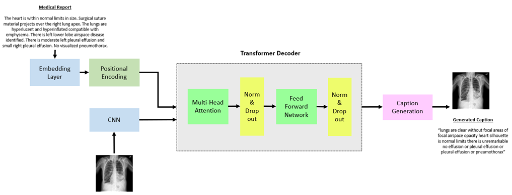
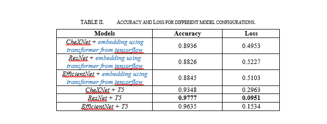
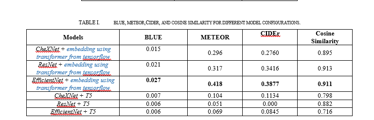
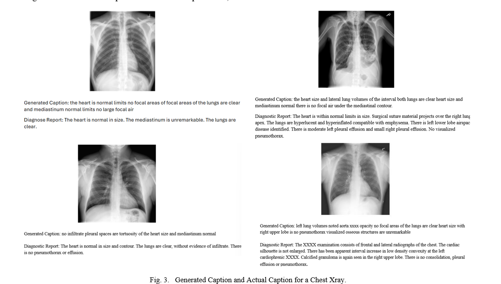

# Entity-Driven Captioning for Chest X-ray Images
**CNN encoders + Transformer decoder with report-aware text embeddings**

This project builds an **entity-aware captioner** that fuses **Chest X-ray image features** with **diagnostic report context** to generate short, clinically meaningful captions. I compare CheXNet (DenseNet-121), ResNet, and EfficientNet encoders with a Transformer decoder, and evaluate with **BLEU**, **METEOR**, **CIDEr**, and **BioBERT cosine similarity**.

> Main notebook: `notebooks/caption-model.ipynb`  
> write-up: `reports/Data_Analysis_Report.pdf`

---

## Overview (what/why)
Radiology is time-constrained and text-heavy. Pure vision captioners often miss domain terms. Here, the decoder attends jointly to **image features** and **report embeddings** (token or **T5-small** fine-tuned on CXR text) so outputs mention **clinically relevant entities** in plain language.

**Contributions**
- **Entity-aware fusion** of X-ray features + report embeddings for more informative captions.
- **Transformer decoder** (multi-head attention, sinusoidal positions, LayerNorm, Dropout).
- **Comparative study** of CNN encoders and text embeddings.
- **Balanced metrics**: lexical (BLEU/METEOR/CIDEr) + **semantic** (BioBERT cosine).

---

## Architecture (short)
The decoder attends over visual features and text context to generate tokens.


*Multi-head attention inside the decoder.*


---

## Data
**IU Chest X-ray (Kaggle)** — ~**7,470** images from **3,955** patients with paired reports.  
Place images under `data/raw/`. Do **not** commit raw data or any PHI.

---

## Method in brief
- **Encoders:** CheXNet / ResNet-50 / EfficientNet → pooled features → linear projection to `d_model`.
- **Text embeddings:** learned token embeddings **or** **T5-small** fine-tuned on *findings/impressions*.
- **Decoder:** Transformer block with multi-head attention; standard sinusoidal positional encoding.
- **Inference:** `<start>` → greedy/beam until `<end>` or max length; safe fallback if no features.

---

## Results (compact)
- Best **semantic alignment** came from **EfficientNet + Transformer (+T5)**.  
- BLEU/METEOR/CIDEr are modest (concise captions), while **cosine similarity is high**, indicating the model captures key findings.

**Training curves**


**Caption metrics**


**Qualitative examples**


---

## Quickstart
```bash
python -m venv .venv
# Windows
.venv\Scripts\activate
pip install -r requirements.txt
jupyter notebook notebooks/caption-model.ipynb
